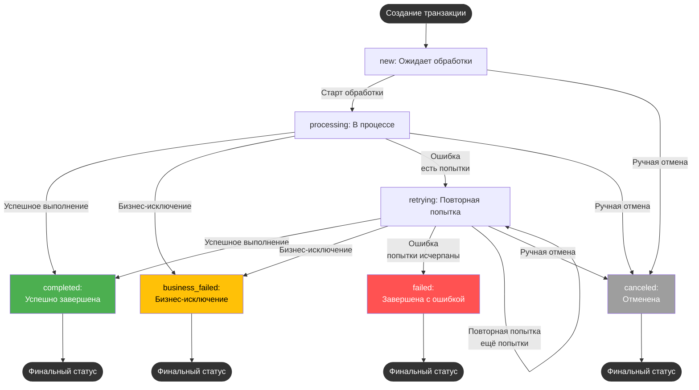

# RPA Project Template  
## Первый Бит, Санкт-Петербург, Центр корпоративных клиентов, BIRPA  
`Версия: [2.2.0] — 20-03-2026`

---

### Оглавление
- [Обзор](#обзор)
- [Требуемые компоненты](#требуемые-компоненты)
- [Архитектурные роли и компоненты](#архитектурные-роли-и-компоненты)
- [Глоссарий глобальных переменных](#глоссарий-глобальных-переменных)
- [Транзакции: структура и жизненный цикл](#транзакции-структура-и-жизненный-цикл)
- [Конфигурация проекта](#конфигурация-проекта)
- [Система отчетности и placeholders писем](#система-отчетности-и-placeholders-писем)
- [Использование проекта](#использование-проекта)
- [Поддержка](#поддержка)
- [Changelog](#changelog)

---

## Обзор

**RPA Project Template** — корпоративный шаблон под PIX Studio, реализующий модульную архитектуру для автоматизированной обработки транзакций через паттерны централизации логики, контроля статусов, логирования, масштабируемых исключений, и расширяемой отчетности. Оптимален для новых кейсов и быстрого включения в работу.

---

## Требуемые компоненты

1. [Пользовательские активности](https://disk.yandex.ru/d/5_aIXz_jzO6Y2g)  
   - Импортировать библиотеки перед запуском в каталог платформы.
2. **Google Chrome** последней версии.
3. Диспетчер учетных данных Windows — записи с именем `Email` и иные, используемые системой.
4. Критичное ПО/доступы — см. ТКП.
5. **PIX Studio 2+**: необходим для корректной работы кастомных активностей.

---

## Архитектурные роли и компоненты

### Архитектурные роли:

| Компонент                      | Уровень         | Ключевые обязанности                                                                                  |
|--------------------------------|-----------------|-------------------------------------------------------------------------------------------------------|
| **main.pix**                   | Инфраструктура  | Инициализация, глобальная обработка ошибок, управление конфигурацией.                                 |
| **core_workflow.pix**          | Координатор     | Координация цикла транзакций: получение батчей, обработка retry, агрегация результатов, финализация.  |
| **process_transaction.pix**    | Исполнитель     | Бизнес-логика выполнения одной транзакции: атомарность, исключения, сохранение результатов.           |

#### Схема координации


#### Файловая структура (основное):
```
rpa_project_template/
├── src/
│   ├── main.pix                   # Запуск, инфраструктура
│   ├── core/
│   │   ├── core_workflow.pix      # Основной цикл
│   │   ├── core_get_transactions.pix  # Загрузка транзакций
│   │   ├── core_report_formatter.pix  # Итоговый HTML-отчет
│   └── process/
│       ├── process_transaction.pix  # Бизнес-логика транзакции
│       └── draft/
│           ├── open_card.pix (пример ошибки)
│           └── check_business_rules.pix (пример бизнес-исключения)
```
---

## Глоссарий глобальных переменных

**`global_context`** — центральный словарь для передачи состояния между компонентами.

### Пути к директориям:

| Ключ                    | Тип        | Описание                                              |
|-------------------------|------------|-------------------------------------------------------|
| `project_root`          | string     | Корневой каталог проекта                              |
| `framework_root`        | string     | Каталог RPA-фреймворка                                |
| `logs_dir`              | string     | Каталог логов                                         |
| `errors_dir`            | string     | Каталог скриншотов ошибок                             |
| `tmp_dir`               | string     | Временные файлы (очищаются при запуске)               |
| `transactions_dir`      | string     | Каталог активных транзакций                           |
| `transactions_archive_dir` | string  | Каталог архивных транзакций                           |

### Файловые и конфигурационные ресурсы:

| Ключ                        | Тип          | Описание                                            |
|-----------------------------|--------------|-----------------------------------------------------|
| `transactions_file`         | string       | Основной текущий CSV-файл транзакций                |
| `config_file`               | string       | Файл конфигурации                                   |
| `log_file`                  | string       | Файл лога текущей сессии                            |
| `work_calendar_file`        | string       | Рабочие/выходные дни                                |
| `email_error_template`      | string       | HTML-шаблон письма при ошибке                       |
| `email_report_template`     | string       | HTML-шаблон отчета                                  |

### Конфигурация и параметры выполнения:

| Ключ                             | Тип            | Описание                                                  |
|-----------------------------------|----------------|-----------------------------------------------------------|
| `config`                         | object         | Загруженная структура из `config.json`                    |
| `transactions`                   | DataTable      | Таблица всех транзакций                                   |
| `available_transaction_slots`    | int            | Свободные слоты транзакций в батче                        |
| `skip_init_next_iteration`       | bool           | Пропустить инициализацию (после бизнес-исключения)        |
| `transactions_processed`         | bool           | Все ли транзакции обработаны                              |
| `reach_error_limit`              | bool           | Достигнут лимит ошибок подряд                             |
| `errors_history`                 | List<string>   | История подряд идущих ошибок                              |
| `screenshot_transaction_file`    | string         | Скриншот ошибки по бизнес-исключению                      |
| `screenshot_retry_counter_{N}_file` | string      | Скриншоты по каждой попытке обработки                     |
| `selected_1c_base`               | string         | Имя базы 1С для запуска                                   |
| `maintenance_active`             | bool           | Активно ли техническое окно                               |
| `transactions_eta_status`        | string         | Расчетное ETA завершения                                  |

### Временные метки и отчетность:

| Ключ              | Тип      | Описание                                     |
|-------------------|----------|----------------------------------------------|
| `start_time`      | DateTime | Начало выполнения                            |
| `end_time`        | DateTime | Завершение                                   |
| `robot_name`      | string   | Имя робота                                   |
| `robot_status`    | string   | Текущий статус                               |
| `custom_content`  | string   | HTML-блок для отчетности, уведомлений        |

**Словарь текущей транзакции**
| Ключ                | Тип        | Описание                                |
|---------------------|------------|-----------------------------------------|
| `transaction`       | DataRow    | Данные транзакции                       |
| `transaction_index` | int        | Индекс в батче                          |
| `retry_counter`     | int        | Попытки обработки                       |

---

## Транзакции: структура и жизненный цикл

### 1. Структура транзакционной таблицы

**Технические поля (добавляются фреймворком):**

| Колонка         | Тип      | Описание                                                         |
|-----------------|----------|------------------------------------------------------------------|
| `rpa_status`    | string   | Текущий статус обработки                                         |
| `rpa_created_at`| DateTime | Дата, время создания                                             |
| `rpa_updated_at`| DateTime | Последнее обновление                                             |
| `rpa_comment`   | string   | Комментарий (ошибка/результат)                                   |
| `rpa_duration_sec`| double | Длительность обработки (сек)                                     |
| `rpa_retries`   | int      | Счетчик попыток обработки                                       |
| `rpa_screenshot`| string   | Путь до скриншота ошибки                                        |

**Пользовательские (пример):**

| Колонка | Описание                        |
|---------|---------------------------------|
| `id`    | Уникальный ID транзакции        |

### 2. Статусы транзакций

| Статус          | Описание                                             |
|-----------------|------------------------------------------------------|
| `new`           | Ожидает обработки                                    |
| `processing`    | В обработке                                          |
| `retrying`      | Повторная попытка                                    |
| `completed`     | Успешно завершена                                    |
| `failed`        | Неудача (исчерпаны попытки)                          |
| `business_failed`| Бизнес-исключение, нужна ручная доработка           |
| `canceled`      | Отменена                                             |

### 3. Жизненный цикл и переходы между статусами



---

## Конфигурация проекта

Конфигурационный файл (`config.json`) определяет все ключевые параметры:

| Параметр                                 | Описание                                              |
|------------------------------------------|-------------------------------------------------------|
| `transaction_handling.max_batch_size`    | Максимум транзакций в одном проходе                   |
| `transaction_handling.max_serial_errors` | Максимальное число подряд ошибок                      |
| `transaction_handling.base_delay_sec`    | Экспоненциальная задержка между попытками             |
| `transaction_handling.notification.enabled/interval` | Уведомления о ходе обработки          |
| `maintenance`                            | Технические окна по cron-выражению, периодичность     |
| `1c_settings`                            | Массив конфигураций подключаемых 1С-баз               |
| ...                                      | Доп. специфические опции проекта                      |

**Пример инициализации путей:**
```csharp
global_context["framework_root"] = framework_root;
global_context["project_root"] = project_root;
```

---

## Система отчетности и placeholders писем

### Итоговые шаблоны (используются в HTML-письмах):

- `robot_name` — имя робота (идентификатор)
- `robot_status` — финальный итог/результат обработки
- `custom_content` — HTML-блок/таблица (например, таблица транзакций или специфичные уведомления)
- `start_time`, `end_time` — временные метки запуска/завершения
- Пути к скриншотам ошибок (например, из `rpa_screenshot` столбца или глобальных переменных)
- `transactions_eta_status` — оценка оставшегося времени

Шаблоны писем (ошибок/отчетов) должны использовать только стандартизированные placeholders — изменение общей структуры шаблонов не допускается.

### Кастомизация:

- Используется HTML-таблица с маппингом тех.статусов к человекочитаемым (через `status_map`).
- Возможно расширение для спец. уведомлений (например, вывод истории ошибок при лимите).

---

## Использование проекта

1. **Запуск:**  
   - `main.pix` инициализирует контекст, загружает компоненты, отправляет уведомление о старте.
2. **Цикл обработки:**  
   - `core_workflow.pix` перебирает транзакции, управляет retry и статусами, собирает историю ошибок и доп.снимки.
3. **Обработка транзакции:**  
   - Вызов `process_transaction.pix` с делением на этапы. Генерирует бизнес/системные ошибки в зависимости от сценария.
4. **Финализация:**  
   - `core_report_formatter.pix` строит итоговый отчет, выполняется отправка по email, архивируются транзакции.
5. **Работа с исключениями:**  
    - Ошибки (Exception): фиксируются, возможны ретраи до `max_serial_errors`, по превышению формируется summary.
    - Бизнес-исключения: переход в статус `business_failed`, счётчик retries сбрасывается.

**Пример фиксации скриншота при бизнес-исключении:**
```csharp
screenshot_transaction_file = global_context["errors_dir"] + @$"\{Guid.NewGuid().ToString()}.png";
TakeScreenshot(screenshot_transaction_file);
transaction["rpa_screenshot"] = screenshot_transaction_file;
global_context["screenshot_transaction_file"] = screenshot_transaction_file;
```

---

## Поддержка
При проблемах/предложениях по фреймворку: `ARBikmuhametov@1cbit.ru`  
Сообщения об ошибках должны содержать:  
- Контекст выполнения
- Ожидаемый и фактический результат

# Changelog
<!-- ### Добавлено (Added) -->
<!-- ### Изменено (Changed) -->
<!-- ### Исправлено (Fixed) -->
<!-- ### Удалено (Removed) -->
<!-- ## [Unreleased] -->
## [2.2.0] — 05-01-2026
### Изменено (Changed)
- Произведен рефакторинг скриптов (Частично обработка ошибки в `core_workflow.pix` вынесена в отдельный скрипт `core_error_handler.pix`)
- Изменены наименования скриптов
- Изменена структура каталогов проекта
- Проверка рабочего дня и технического окна убрана в вызов `framework_loader.pix`
### Удалено (Removed)
- Удален флаг `reach_error_limit` как избыточный

## [2.1.5] — 05-01-2026
### Добавлено (Added)
* В стандартную таблицу транзакций добавлен новый столбец `"rpa_screenshot"` для хранения пути к скриншоту ошибки, привязанного к каждой транзакции (включён в шаблон `transactions_template.csv`).
> Используйте поле `rpa_screenshot` для удобной дальнейшей диагностики ошибок прямо из итоговой отчётности и Excel-экспорта.  
### Изменено (Changed)
- Изменена сигнатура вызова скрипта `transaction_state_manager.pix`.
- Логика main_workflow.pix адаптирована для передачи только необходимых полей при обновлении состояния транзакции.

### Изменено (Changed)
* **В `report_customization.pix` реализовано отображение русскоязычных статусов транзакций в итоговой отчетности.**
    - Технические статусы транзакций (`new`, `processing`, `retrying`, `completed`, `business_failed`, `failed`, `canceled`) автоматически заменяются на читаемые формулировки.
    - Если статус вне диапазона допустимых, подставляется значение "Неизвестно".

## [2.1.4] — 23-11-2025
### Исправлено (Fixed)
* В `main_workflow.pix` устранена проблема с обработкой бизнес-исключений: ранее, если бизнес-ошибка возникала на последней попытке, это приводило к генерации финального исключения и завершению работы робота. Теперь подобные ситуации обрабатываются корректно — робот продолжает работу, если ошибка бизнесовая, даже на последней попытке.
### Добавлено (Added)
* В `get_transactions.pix` добавлено логирование загруженных транзакций в `local_transactions`. Теперь при разборе инцидентов можно отслеживать исходные данные транзакций на начальном этапе процесса.
### Удалено (Removed)
* Убраны шаги по удалению ключей `screenshot_transaction_file`, `custom_content`. Данные параметры используются в скрипте `send_report.pix` (модуль `rpa_framework`), теперь логика по удалению вынесена в общий скрипт сразу после использования (отправки SMTP)

## [2.1.3] — 15-11-2025
### Добавлено (Added)
* В основной сценарий `main_workflow.pix` добавлен механизм накопления истории ошибок: при возникновении подряд нескольких ошибок обработки (по количеству, заданному в параметре `max_serial_errors`) все сообщения об ошибках сохраняются в список `errors_history`. В случае достижения лимита ошибок в итоговое сообщение об остановке процесса теперь включается подробная история последних подряд идущих ошибок.

* Добавлен новый статус транзакции `business_failed` — "Завершена с бизнес-исключением" (нарушены бизнес-правила, не программная ошибка). Транзакции с этим статусом невозможно взять в повторную обработку, статус учитывается при итоговом анализе выполнения процесса.

### Изменено (Changed)
* Изменён порядок обработки бизнес-исключений в основном сценарии `main_workflow.pix`: теперь при возникновении бизнес-исключения транзакции присваивается статус `business_failed` вместо `completed`.

## [2.1.2] — 18-10-2025
### Изменено (Changed)

1. **Добавлен флаг для выбора базы 1С**
   - Новый параметр в глобальном контексте:
     ```
     selected_1c_base | string | Имя базы, которая будет запущена при вызове `app_launcher_1c.pix`
     ```
   - Позволяет явно выбирать нужную базу из списка, описанного в конфигурации.

2. **Рефакторинг структуры `1c_settings` в config.json**
   - Вместо одного объекта теперь используется массив баз.
   - Каждый элемент массива содержит:
     - `base_name` — уникальный идентификатор базы,
     - `base_type` — тип базы (`server`, `file`, `web`),
     - `platform_path` — путь к исполняемому файлу платформы 1С,
     - `base_path` — путь подключения к базе,
     - `credentials_key` — ключ для доступа к логину и паролю в credentials,
     - `connection_timeout` — таймаут ожидания подключения в секундах.
   - Можно описать произвольное количество баз с индивидуальными настройками.

3. **Обновлён скрипт `app_launcher_1c.pix` (модуль: `rpa_framework`)**
   - Теперь для выбранной базы автоматически используются соответствующие логин и пароль на основании `global_context["selected_1c_base"]`.
   - Корректно учитывается тип базы (формируется нужный ключ запуска — `/S`, `/F`, `/WS`).
   - Не требует ручных изменений при добавлении новых баз в конфиг.
   - Добавлено закрытие окна "Отключить использование аппаратной лицензии?"
   - Улучшено логирование и добавлен таймер при открытии 1С

### Добавлено (Added)
1. **В `rpa_framework` добавлен скрипт `transactions_eta.pix` для подсчета оставшегося времени.**
    - Позволяет в любой момент рассчитать и получить оценку оставшегося времени (ETA) до завершения обработки всех активных транзакций.
    - Формирует удобную для пользователя строку-уведомление с примерным временем окончания обработки и размещает результат в `global_context["transactions_eta_status"]`.
    - Использует значение `seconds_per_transaction` из конфигурации (`transaction_handling`).
2. В `main_workflow.pix` добавлен вызов общего скрипта `transactions_eta.pix` для подсчета оставшегося времени.

## [2.1.1] - 03-10-2025
### Добавлено (Added)
* В скрипте `main_workflow.pix` добавлена автоматическая фиксация и сохранение скриншотов интерфейса при каждом возникновении ошибки в ходе последовательных попыток обработки транзакций.  
При каждой неудачной попытке обработки транзакции формируется уникальный скриншот, путь к которому сохраняется в `global_context` с ключём вида `screenshot_retry_counter_{N}_file`.

### Изменено (Changed)
* Обработка превышения лимита последовательных ошибок (`max_serial_errors`):  
  Теперь при достижении лимита к автоматическому отчёту об ошибке прикладываются все скриншоты, сделанные на каждой неудачной попытке, для облегчения диагностики и последующего анализа инцидента (скрипт `send_error_report.pix`).

## [2.1.0] - 01-09-2025
### Добавлено (Added)
* В конфигурационный файл (`config.json`) добавлен блок `maintenance` для задания технических окон по cron-выражению. Теперь можно гибко указать периоды, в которые робот не должен работать.
  - **Проверка на старте:** Перед запуском робот проверяет, попадает ли текущее время в техническое окно. Это позволяет избежать случайных запусков в период недоступности даже при ошибках в расписании.
  - **Проверка в цикле обработки:** Во время длительной работы робот контролирует наступление технического окна и при необходимости завершает текущий цикл обработки, чтобы не нарушать регламент.
  - **Параметр `window_ahead_min`:** Позволяет задавать минимальное количество минут до начала технического окна, необходимое для запуска новой транзакции. Если до технического окна меньше указанного значения, новая обработка не запускается.

  Пример конфигурации:
  ```json
  "maintenance": {
      "_comment": "Тех. окна по одному cron-выражению. Если время попадает под любой из указанных дней/часов — робот не работает.",
      "enabled": true,
      "cron": "0 0 1-3 ? * SUN,MON,WED,FRI *",
      "_comment_cron": "С 01:00 до 03:59 каждое воскресенье, понедельник, среду и пятницу",
      "window_ahead_min": 30,
      "_comment_window_ahead_min": "Минимальное количество минут до наступления технического окна, которое должно оставаться для запуска новой транзакции. Например, если до начала тех. окна осталось меньше 30 минут, новая обработка не запускается."
  }

### Изменено (Changed)
* Логика кастомизации отчёта вынесена из основного скрипта (`main`) в отдельный скрипт — `report_customization.pix`. 
  Все операции по подготовке отчётной таблицы представлены в виде отдельного шаблонного скрипта.
  Такой подход упрощает адаптацию отчёта под требования конкретного проекта.

## [2.0.1] - 28-08-2025
### Добавлено (Added)
* В скрипте `main_workflow.pix` в словарь `global_context` добавлен флаг `skip_init_next_iteration`. Указывает, что инициализация параметров и авторизация должны быть пропущены на одну итерацию после возникновения бизнес-ошибки. Флаг автоматически удаляется перед входом в цикл транзакционной обработки.

### Изменено (Changed)
* В скрипте `main_workflow.pix` в блоке `catch` вынесена инициализация флага превышения лимита ошибок `reach_limit_error`. Его отсутствие в этом месте приводило к бесконечным циклам внутри `while` до того, как мы попадали в цикл транзакционной ошибки
  ```csharp 
  if (retry_counter == ((System.Text.Json.JsonElement)global_context["config"]).GetProperty("transaction_handling")
                                                                          .GetProperty("max_serial_errors")
                                                                          .GetInt32())
  {
    global_context["reach_error_limit"] = true; // взводим флаг для фиксации факта превышения лимита безусловно (транзакционная ошибка, либо иная)
  }
  ```

## [2.0.0] - 05-08-2025
### Исправлено (Fixed)
* Перенесена логика авторизации и получения транзакций в блок `try/catch/finally` в скрипте `main_workflow.pix`. Теперь ошибки на этапах авторизации и получения транзакций корректно обрабатываются механизмом повторов.
### Изменено (Changed)
* Изменен тип для `rpa_duration_sec` с Int32 на double
* Изменена сигнатура вызова `framework_loader\...\transaction_state_manager.pix`: убран параметр `(int) transaction_index`, сделан обязательным `(DataRow) transaction`. В связи с этим отрефакторены вызывающие скрипты.
### Добавлено (Added)
* В `config.json` добавлен ключ "ssl"
```json
"_comment_ssl": "Используется для активации/снятия флага \"Использовать SSL\" в `framework_loader\\...\\send_report.pix' и `framework_loader\\...\\send_error_report.pix'",
    "ssl": true
```
* В `main_workflow.pix` добавлена единая обработка транзакционных ошибок в блоке `try/catch/finally`.  
Предусмотрен отдельный ключ для скриншота подобной ошибки в словаре 
  ```csharp 
  global_context["screenshot_transaction_file"]
  ```
  В `finally` блоке предусмотрено удаление ключа перед потенциально новой итерацией
* В `framework_loader\...\send_report.pix` добавлена обработка нового ключа со скриншотом транзакционной ошибки
* Добавлено уведомление при запуске робота
* Добавлен скрипт для транзакционной обработки `transaction_workflow.pix`.  
  Заложенная концепция на диаграмме ниже
    ```mermaid
      flowchart LR
      A[main.pix<br>Инфраструктура] -->|Инициализация<br>фреймворка| B[main_workflow.pix<br>Координатор]
      B -->|Цикл обработки| C[transaction_workflow.pix<br>Исполнитель]
      C -->|Результат| B
      style A fill:#5e81ac,color:white
      style B fill:#88c0d0,color:black
      style C fill:#bf616a,color:white
    ```
* Добавлены псевдо-скрипты в `workflows\pseudo\...` для демонстрации концепции работы с исключениями и прерыванием скриптов.